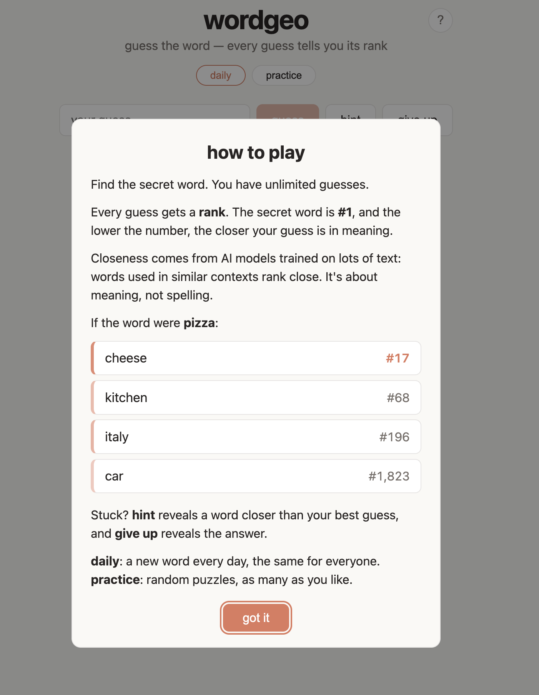

# wordgeo

A Contexto-style word-guessing game built on semantic similarity.

**Play:** https://ayush-207.github.io/wordgeo/



There's a secret word. Every guess gets a **rank**: 1 is the secret word itself, and 500 means your guess is the 500th-closest word to it in the vocabulary. Lower is warmer. Use your best guesses to work your way toward the answer.

- **Daily mode**: everyone gets the same puzzle, derived from the date
- **Practice mode**: a random puzzle that avoids your 30 most recent ones
- **Hint**: reveals a word ranked at about ¾ of your best guess's rank (your first hint lands near #4000)
- **Give up**: reveals the answer, after a confirm click
- Progress is saved in the browser, and you can copy a shareable result

## How it works

Rankings are computed offline and shipped as static files. The browser never runs a model, and there is no backend.

- **Embeddings:** an ensemble of two models. [Model2Vec `potion-base-32M`](https://huggingface.co/minishlab/potion-base-32M) (512 dims, distilled from a sentence transformer) and [GloVe 6B 300d](https://nlp.stanford.edu/projects/glove/) (co-occurrence). Each model's cosines are z-scored against its own random-pair noise floor, then averaged.
- **Why both:** on human similarity ratings, the ensemble beats either model on relatedness, which is what the game rewards:

  | benchmark (Spearman ρ) | GloVe | Model2Vec | ensemble |
  |---|---|---|---|
  | MEN-3000 (relatedness) | 0.738 | 0.770 | **0.842** |
  | WS-353 relatedness | 0.573 | 0.694 | **0.754** |
  | SimLex-999 (strict similarity) | 0.373 | **0.658** | 0.599 |

  Reproduce with `scripts/benchmark.py`. See [Why an ensemble](#why-an-ensemble) below.
- **Vocabulary:** 39,210 words, which are all the plain lowercase words in the Model2Vec tokenizer
- **Puzzles:** 200 curated secret words (`scripts/secrets.txt`). For each one, the build scores the whole vocabulary with the ensemble, sorts it, and writes one rank table.
- **Daily id:** `days since LAUNCH_DATE % 200` (`app/src/game/modes.ts`)

### Why an ensemble

**The two models make different mistakes.** GloVe learns from news co-occurrence (`bush` → clinton, obama), while Model2Vec inherits its teacher's cultural associations (`banana` → reggae, blouse). On 50,000 random, unrelated word pairs, their scores correlate only 0.28. Averaging two equally noisy scores with that correlation keeps the shared signal and leaves √((1 + 0.28) / 2) ≈ 0.80 of the noise.

**The game rewards relatedness, not strict similarity.** SimLex-999 scores *dog–cat* 1.8/10 and *wife–husband* 2.3/10, because they're related but not the same kind of thing. A game scored that way would call `cat` cold for the secret `dog`. Players navigate by association, which MEN and WS-353 relatedness measure, and that's where the ensemble wins. It loses on SimLex because GloVe is much weaker at strict similarity (0.37 vs 0.66) and dilutes Model2Vec. For a synonym game, Model2Vec alone would be the right choice.

**Why z-score before averaging.** The models' cosines have different spreads on unrelated pairs (GloVe ±0.087, Model2Vec ±0.070), so averaging raw cosines would give the wider-spread model more say. Converting each cosine to "noise-widths above chance" gives each model an equal vote. Here the correction is modest (on average 94 of the top 100 words are unchanged), but it keeps the ensemble sound if a model with a very different scale is swapped in.

**Caveat:** the ensemble was chosen after seeing these benchmarks, so they flatter it slightly. Its gain holds on two separate relatedness datasets.

### Puzzle file format

`data/puzzles/puzzle-NNN.bin` is about 78 KB. All integers are little-endian.

| bytes | field |
|---|---|
| 0–3 | magic `WG01` |
| 4–7 | `vocab_size` uint32 |
| 8–11 | `secret_index` uint32, the secret's index into `vocab.json` |
| 12– | `ranks` uint16 × `vocab_size`, where `ranks[i]` is the 1-based rank of `vocab[i]` |

The format doesn't depend on the embedding model. You can swap the model in `scripts/build.py` without touching the app.

### A note on cheating

The answers can be read from the shipped files: every puzzle file contains `secret_index`. That's a deliberate tradeoff for a static, serverless game. If it ever matters, `createLookup()` in `app/src/game/puzzle.ts` is where a server-side rank API would plug in.

## Structure

```
scripts/
  build.py              embeddings → vocab + 200 rank tables (validates every row is a permutation, secret = #1)
  benchmark.py          scores GloVe / Model2Vec / ensemble against SimLex, WordSim-353 and MEN
  secrets.txt           the 200 secret words
  compare_model2vec.py  harness for comparing top-10 neighbours between GloVe and Model2Vec
data/                   vocab.json + puzzles/*.bin (committed build artifacts)
app/
  src/game/             puzzle parsing, modes, hints, storage, share text (unit-tested)
  src/components/       guess input + guess list
  e2e/play.test.js      Playwright playtest
.github/workflows/      test → build → deploy to GitHub Pages on every push to main
```

## Development

### Rebuild the puzzles

```bash
cd scripts
uv venv .venv && uv pip install --python .venv/bin/python numpy==2.5.3 model2vec==0.9.0
curl -L -o cache/glove.6B.zip https://nlp.stanford.edu/data/glove.6B.zip   # 822 MB, gitignored
.venv/bin/python build.py       # downloads potion-base-32M (~130 MB) from Hugging Face on first run
.venv/bin/python benchmark.py   # optional: word-similarity benchmark
```

`build.py` rewrites `data/`, so commit the result. Changing the model or `secrets.txt` changes every rank, and saved games will then mix the old and new rankings. Do it deliberately.

### Frontend

```bash
cd app
npm install
npm run dev        # http://localhost:5173/wordgeo/
npm test           # unit tests (vitest)
npm run build && npm run preview &
node e2e/play.test.js   # e2e playtest against the preview server on :4173
```

`app/public/data` is a symlink to `../../data`. In CI, the workflow copies `data/` into `dist/` instead.

## Analytics

Visits and gameplay are counted with [GoatCounter](https://www.goatcounter.com/), which uses no cookies and stores no personal data. Page views are counted automatically. The game also sends anonymous events: `start-*` (first guess), `solve-*`, `give-up-*` (each for `daily` or `practice`), `hint` and `copy-result`.

Everything lives in `app/src/analytics.ts` and does nothing until `GOATCOUNTER_CODE` is set. GoatCounter ignores localhost, so dev and e2e runs are never counted.

## Deployment

Every push to `main` runs the GitHub Actions workflow, which tests, builds, and publishes to GitHub Pages. The Vite `base` defaults to `/wordgeo/` and can be overridden with `VITE_BASE`.
